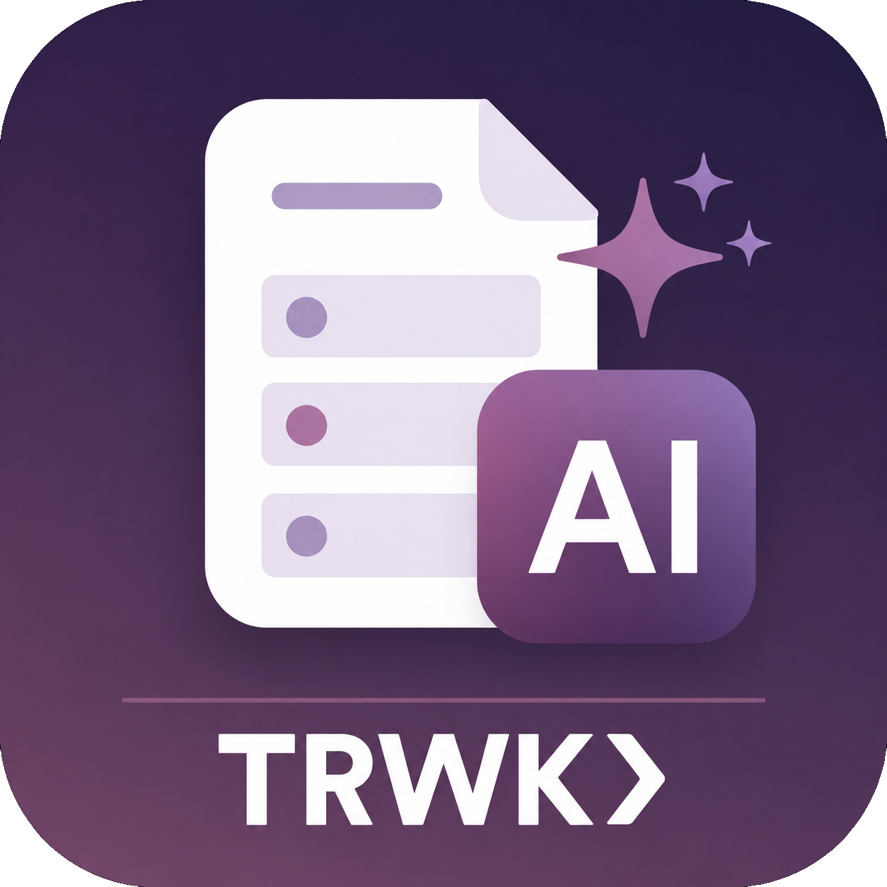
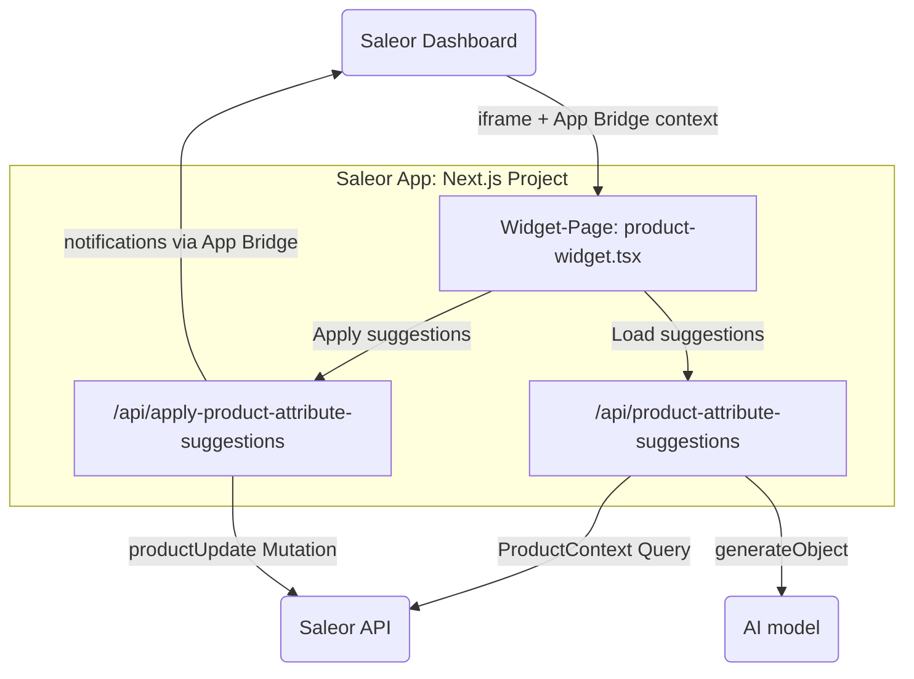

<div align="center">

</div>

<div align="center">
  <h1>Product AI Assistant — Saleor App</h1>
</div>

<div align="center">
  <p>A Saleor Dashboard widget that reads product context and suggests missing structured attribute values using an LLM.</p>
</div>

<div align="center">
  <a href="https://saleor.io/">Saleor</a>
  <span> | </span>
  <a href="https://docs.saleor.io/developer/extending/apps/developing-apps">App Docs</a>
  <span> | </span>
  <a href="https://docs.saleor.io/developer/extending/apps/extending-dashboard-with-apps">Dashboard Extensions</a>
  <span> | </span>
<a href="https://trwk.de/contact">TRWK> (Sponsor)</a>
</div>

> [!TIP]
> This app is the demo from the article [From Product Data Gaps to Structured Catalogs: Building an AI Saleor App with Dashboard Widgets](./writing/final/version-0-G55.md).

## What it does

When a staff user opens a product in the Saleor Dashboard, the widget reads the existing product description, identifies attribute slots on the product type that are empty, and asks an LLM (OpenAI) to extract structured values from the description. Each suggestion includes a short evidence quote copied from the text. The staff user reviews suggestions and applies approved ones back to Saleor with a single click.

Nothing is written to the catalog until a human explicitly clicks _Apply_.

## Architecture



Key pieces:

- **One manifest extension** — `PRODUCT_DETAILS_WIDGETS` with `target: "WIDGET"`.
- **Two protected API routes** — one to read product context and produce suggestions, one to apply approved suggestions. Both use `createProtectedHandler` from the Saleor App SDK, which verifies the staff JWT, enforces `MANAGE_PRODUCTS`, and resolves the app token from the APL.
- **Two GraphQL operations** — a `ProductContext` query and a `productUpdate` mutation (see `graphql/`).
- **One structured AI call** — `generateObject` from the Vercel AI SDK with a Zod schema. The model sees only the attribute IDs and choice slugs that actually exist on this product type.

## Tech stack

| Layer              | Technology                                                       |
| ------------------ | ---------------------------------------------------------------- |
| Framework          | Next.js 15                                                       |
| Saleor integration | `@saleor/app-sdk` 1.5, App Bridge, `createProtectedHandler`, APL |
| UI                 | `@saleor/macaw-ui` (Saleor's Dashboard UI library)               |
| GraphQL client     | urql, typed via GraphQL Codegen                                  |
| AI                 | Vercel AI SDK (`ai`, `@ai-sdk/openai`), `generateObject`         |
| Validation         | Zod                                                              |

## Requirements

- [Node.js 22](https://nodejs.org/)
- [pnpm 10](https://pnpm.io/)
- An [OpenAI API key](https://platform.openai.com/api-keys)
- A Saleor Cloud account or a locally running Saleor instance

## Development

### 1. Install dependencies

```bash
pnpm install
```

### 2. Set environment variables

Copy the example file and fill in the values:

```bash
cp .env.example .env
```

| Variable                        | Description                                                             |
| ------------------------------- | ----------------------------------------------------------------------- |
| `SECRET_KEY`                    | Random string used to sign App Bridge JWTs                              |
| `APL`                           | Auth Persistence Layer — `file` for local dev, `upstash` for production |
| `UPSTASH_URL` / `UPSTASH_TOKEN` | Required only when `APL=upstash`                                        |
| `OPENAI_API_KEY`                | OpenAI API key used by the suggestions route                            |
| `OPENAI_MODEL`                  | Optional — defaults to `gpt-4o-mini`                                    |

### 3. Start the development server

```bash
pnpm dev
```

### 4. Expose the app through a tunnel

Saleor needs a publicly reachable URL to install the app and deliver iframe requests. Use [ngrok](https://ngrok.com/) or [localtunnel](https://github.com/localtunnel/localtunnel):

```bash
ngrok http 3000
```

### 5. Install in Saleor

Open your Saleor Dashboard and navigate to:

```
[YOUR_SALEOR_DASHBOARD_URL]/apps/install?manifestUrl=[YOUR_TUNNEL_URL]/api/manifest
```

After installation, open any product detail page — the **Product AI Assistant** widget appears in the Apps panel on the right side of the page (Due to a bug in saleor dashboard a hard reload or loggin/loggout is sometimes required before the widget appears).

## GraphQL types

The project uses GraphQL Codegen to generate typed urql hooks and typed document nodes from the Saleor schema. Commit the `generated/` folder — it is required at build time and tracks schema changes explicitly.

To regenerate after changing a query or mutation:

```bash
pnpm generate
```

## Auth Persistence Layer (APL)

When Saleor installs an app it passes a long-lived app token. The APL is where that token is stored between requests. Two options are supported:

- `file` — writes to a local JSON file. Fine for development, not suitable for multi-tenant or production use.
- `upstash` — uses [Upstash](https://upstash.com/) Redis. Works for production and supports multi-tenancy. Requires `UPSTASH_URL` and `UPSTASH_TOKEN`.

See the [APL documentation](https://docs.saleor.io/developer/extending/apps/developing-apps/app-sdk/apl) for implementing a custom store.

## Guardrails

The app enforces several invariants to keep AI suggestions safe:

- The model only sees attribute IDs and choice slugs that exist on this product's product type — no hallucinated attribute IDs.
- For dropdown and multiselect attributes, the model must return one of the allowed Saleor choice slugs — no invented labels.
- Every suggestion must include an evidence quote copied from the product description.
- Server-side Zod validation normalizes and rejects any suggestion that does not match the expected per-`inputType` shape.
- A second Zod discriminated union re-validates the apply payload before any mutation is executed.
- `MANAGE_PRODUCTS` is enforced server-side on both routes — not on the client.
- The OpenAI key and the Saleor app token never leave the server.

## Sponsor

This project is created and maintained by [TRWK>](https://trwk.de), formerly [trieb.work](https://trieb.work) — a Next.js, Saleor & Payload CMS agency.

Saleor extensions, AI-assisted catalog enrichment, and AI-ready product data for agentic commerce are the kind of work we do day-to-day. If that overlaps with what your team is planning, [get in touch](https://trwk.de/contact).

## License

`BSD-3-Clause AND CC-BY-4.0` — see [LICENSE](./LICENSE).
